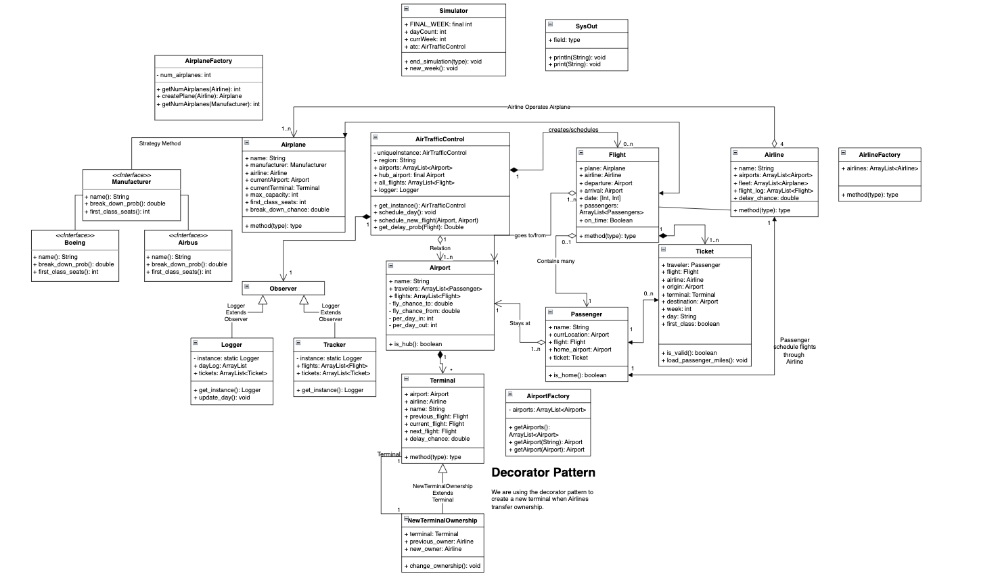
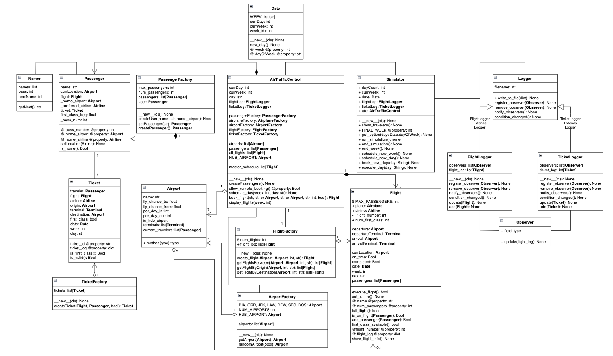

# Airport Simulator
Group Members: Thor Breece, Zach Wrubel  
Python Version: 3.7.6

# Plan for Next Iteration/Todo:
- change date issues
    - Which classes/methods need to use `Date()` and which need the day/week passed in?
- Assigning planes to each flight and to each airline
- User interface completion
- Loading passenger data from csv?
- Assigning airlinees to flights.

# UML Diagram
## Original UML Diagram
[Link to original diagram](https://viewer.diagrams.net/?page-id=2qr1L9LIx3St7QkkywdC&highlight=0000ff&edit=_blank&layers=1&nav=1&page-id=2qr1L9LIx3St7QkkywdC#G15eHamhE6qX8YW4MaNakGbIdoC5Cm6Xfl)



## UML Diagram for Project 6
**Changes between Project 5 & 6**:  
- 

[Link to update diagram](
    
)  


## UML Diagram for Project 6

# OO Patterns
## Strategy
We're using the Strategy pattern to set the airline and manufacturer of each airplane.  The implementation is almost identical to the strategy pattern implementation in project 3.  We have the code of the strategy pattern done here but haven't incorporated in the airplanes yet.

## Factory
We are using the Factory pattern to encapsulate the generation/creation of the `Flight`, `Passenger`, `Ticket`, `Airport`, & `Airplane` objects.  The AirTrafficController will acccess the factories.  Each factory is a singleton instance.  We are also using these factories to deal with accessing the objects they create.  This is to ensure the same object isn't stored in multiple places.

## Observer
The Observer pattern is being used to keep an external record of flights and tickets outside of memory.  We are writing each ticket and flight that is created to their respective files to ensure there are logs of what exactly was created each time the simulation was run.

## Singleton
We're using the Singleton pattern on a number of classes to ensure only one object created.  The classes implementing this pattern are `Date`, `Simulator`, `AirTrafficControl`, `PassengerFactory`, `FlightFactory`, `TicketFactory`, `AirportFactory`,`TicketLogger`, `FlightLogger`, & `AirplaneFactory`.  There is no need for there to be multiple instances of any of these classes.

Source: Lecture 16 Singleton Pattern Slide 17
```python
class Foo:
    def __new__(cls, *args, **kwds):
        """Singleton Implementation"""
        it = cls.__dict__.get("__it__")
        if it is not None:
            return it
        cls.__it__ = it = object.__new__(cls)
        return it
    def __init__(self):
        pass
f = Foo()
f1 = Foo()
f is f1  # True
```
