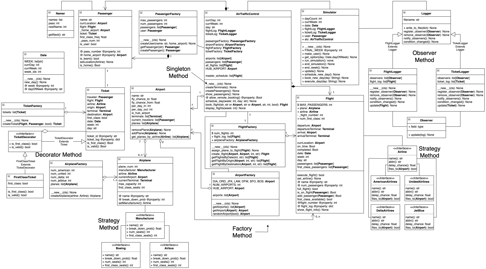

# Airport Simulator
Group Members: Thor Breece, Zach Wrubel  
Python Version: 3.7.6  

[Airport Simulator GitHub Repository Link](https://github.com/Zwrubel23/AirportSimulator)  
[Demonstration Video Link](https://drive.google.com/file/d/1EUjj14grqBhV8jFT0Xqg9AlXQMWHbAXe/view)

- [Project 5 Doc](https://docs.google.com/document/d/1srraslvd6D41PhM7-ngxCDRBx1V2nsNrJe_tZyqU9vI)  
- [Project 6 Update Doc](https://docs.google.com/document/d/1lTd_Obhb-ObWvSxy6roiW088rLJIcnWWHxBVC6YQ9YE)  
- [Project 7 Final Submission Doc](https://docs.google.com/document/d/1-ke3bBm6SNGrwa3oxmXZs79X1ZZYQXKN_umz7BewDXw)


# Instructions to run
If running normally from the terminal run `make test`.  The program will execute and fill the SimResults file as well as the flight & ticket logs.  

If running from the jupyter notebook, enter `make clean` in the terminal, then restart the kernel, clear all outputs, and run all cells.  The program will execute and fill the SimResults file as well as the flight & ticket logs.  

If using the (optional) user interface, run from the jupyter notebook since it has better UI controls than directly running through the terminal.


# UML Diagram
## Original UML Diagram
[Link to original diagram](https://viewer.diagrams.net/?page-id=2qr1L9LIx3St7QkkywdC&highlight=0000ff&edit=_blank&layers=1&nav=1&page-id=2qr1L9LIx3St7QkkywdC#G15eHamhE6qX8YW4MaNakGbIdoC5Cm6Xfl)


## UML Diagram for Project 6
**Changes between Project 5 & 6**:  
- Switched from Java to Python
- Increased use of factories
- Increased the use of singletons in many classes like factories, ATC, Simulator
- Reorganized connections between classes

[Link to update diagram](https://viewer.diagrams.net/?page-id=wD2FBakeB_3jat474W7Z&highlight=0000ff&edit=_blank&layers=1&nav=1&page-id=wD2FBakeB_3jat474W7Z#G15eHamhE6qX8YW4MaNakGbIdoC5Cm6Xfl)  


# UML Diagram for Project 7
**Changes between project 6 & 7**:
- Airlines are now singletons
- Reorganization of some variables/trackers between classes. (Ex. Moved airplaneFactory from AirTrafficControl to flightFactory)
- Decorator pattern implemented for converting Tickets to FirstClassTickets.
- Strategy pattern:
    - Used for airlines within flight object
    - Used for setting airplane manufacturer within Airplane object
- While it doesn't show in the diagram, we removed the terminals which used the decorator pattern.
- Implementation of user interface. Not really shown in diagram except for make_user() method and user object within Simulator, and is_user boolean within Passenger.
- Implementation of Airplane and AirplaneFactory
- Other minor edits/additions

[Link to updated diagram](https://viewer.diagrams.net/?page-id=wD2FBakeB_3jat474W7Z&highlight=0000ff&edit=_blank&layers=1&nav=1&page-id=wD2FBakeB_3jat474W7Z#G15eHamhE6qX8YW4MaNakGbIdoC5Cm6Xfl)


# OO Patterns
## Strategy
We're using the Strategy pattern to set the airline of a flight and the manufacturer of each airplane.  The implementation is almost identical to the strategy pattern implementation in project 3.  

## Factory
We are using the Factory pattern to encapsulate the generation/creation of the `Flight`, `Passenger`, `Ticket`, `Airport`, & `Airplane` objects.  The AirTrafficController will acccess most of the factories, and the FlightFactory will access the AirplaneFactory.  Each factory is a singleton instance.  We are also using these factories to deal with accessing the objects they create.  This is to ensure the same object isn't stored in multiple places and that objects aren't created more times than they should be.

## Observer
The Observer pattern is being used to keep an external record of flights and tickets outside of memory.  We are writing each ticket and flight that is created to their respective files to ensure there are logs of what exactly was created each time the simulation was run.  Flights are added to the flightlog after a flight has executed, and tickets are added to the ticketlog after the ticket is created while booking the flight.

## Singleton
We're using the Singleton pattern on a number of classes to ensure only one object created.  The classes implementing this pattern are `Date`, `Simulator`, `AirTrafficControl`, `PassengerFactory`, `FlightFactory`, `TicketFactory`, `AirportFactory`,`TicketLogger`, `FlightLogger`, & `AirplaneFactory`.  There is no need for there to be multiple instances of any of these classes.

Source: Lecture 16 Singleton Pattern Slide 17
```python
class Foo:
    def __new__(cls, *args, **kwds):
        """Singleton Implementation"""
        it = cls.__dict__.get("__it__")
        if it is not None:
            return it
        cls.__it__ = it = object.__new__(cls)
        return it
    def __init__(self):
        pass
f = Foo()
f1 = Foo()
f is f1  # True
```

## Decorator Pattern
We will use the decorator pattern to make a normal ticket a first class ticket.  The implementation is executed in the createTicket method of the ticketFactory.


# Info
We will have 7 airports in the simulation including the hub airport. 

Below is a breakdown of each airport and which airlines fly in/out of them:  
| | DIA | ORD | JFK | LAX | DFW | SFO | BOS |
|-|-----|-----|-----|-----|-----|-----|-----|
| American Airlines | Yes | Yes | Yes | Yes | Yes | Yes | No |
| United Airlines | Yes | Yes | No | Yes | Yes | Yes | No |
| Delta Airlines | Yes | No | Yes | No | No | Yes | Yes |
| JetBlue | Yes | No | No | Yes | No | No | Yes |

Below is a breakdown of which airlines are flying planes made by a certain manufacturer  

| Airline | Boeing | Airbus |
|---------|--------|--------|
| American Airlines | Yes | No |
| United Airlines | Yes | Yes |
| Delta Airlines | No |  Yes |
| JetBlue | Yes | No |
